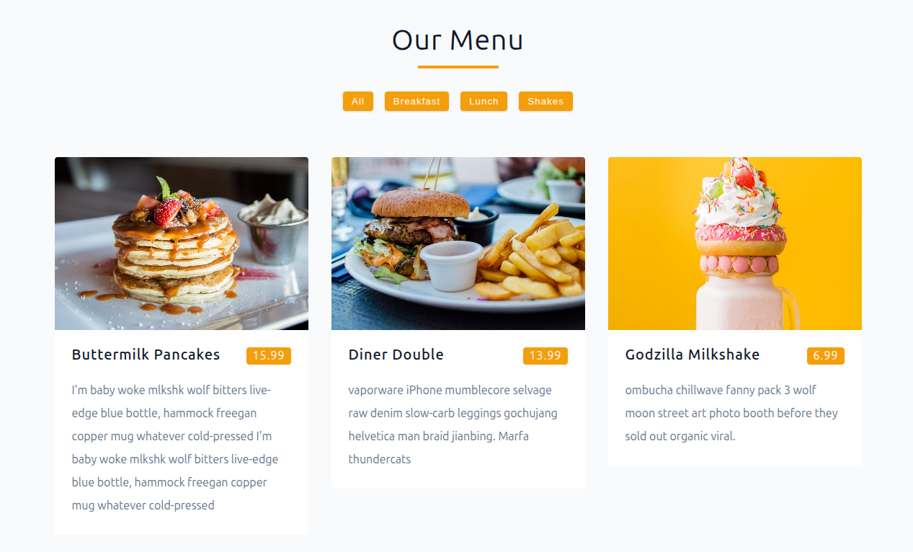

# Menu Filter UI 🍽️


A React practice project featuring a dynamic menu with category filtering functionality. Built to practice state management and component composition in React.



## ✨ Features

- **Category Filtering** - Dynamic filtering of menu items by category
- **Responsive Grid Layout** - Adapts to different screen sizes
- **Interactive UI** - Smooth category selection with visual feedback
- **State Management** - Efficient state handling with useState hook
- **Component Architecture** - Well-structured component hierarchy

## 💡 Key Learnings / Implemented Challenges

This project was created to complete specific challenges focused on foundational React concepts:

- **Component Communication** - Sharing data and callback functions between parent and child components via props
- **State Management** - Using useState hook for menu items and categories
- **Dynamic Filtering** - Implementing category-based filtering functionality
- **Component Composition** - Building reusable Title, Menu, MenuItem, and Categories components
- **Data Handling** - Importing and manipulating menu data from external file
- **Array Methods** - Utilizing map(), filter(), and Set for data manipulation
- **Conditional Rendering** - Dynamically displaying menu items based on selected category
- **Event Handling** - Implementing click events for category filtering

## 🧰 Built With

- Vite + React
- JavaScript (ES6+)
- HTML5 & CSS3

## ▶️ Live Demo

**View Live on Netlify:**
[Click here](https://menu-project-gpdev.netlify.app/)

## 🎨 Design

Figma design provided by the course instructor:[ Preview here](https://www.figma.com/file/PwlnSJXCuo4qD2o6EJiuj9/Menu?node-id=0%3A1&t=oaKVwYVqc9Oon2Ts-1)

## 📦 Getting Started

### Prerequisites

- **Node.js ≥ 18**
- **npm or yarn**

### Installation

1. Clone the repository

```bash
git clone https://github.com/pro804/Menu-Filter-UI.git
```

2. Navigate to the project directory

```bash
cd Menu-Filter-UI
```

3. Install dependencies

```bash
npm install
```

4. Start the development server

```bash
npm run dev
```

5. Open http://localhost:5173 to view it in the browser.

## 🔧 Scripts

- `npm run dev` — Runs the development server (Vite)
- `npm run build` — Builds the app for production
- `npm run preview` — Previews the production build locally

## 📄 License

This project is created for educational purposes as part of a React learning journey.
